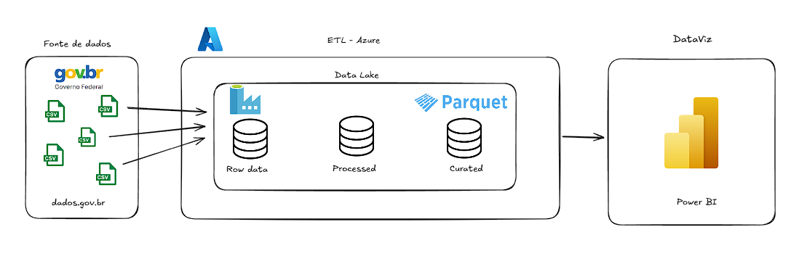
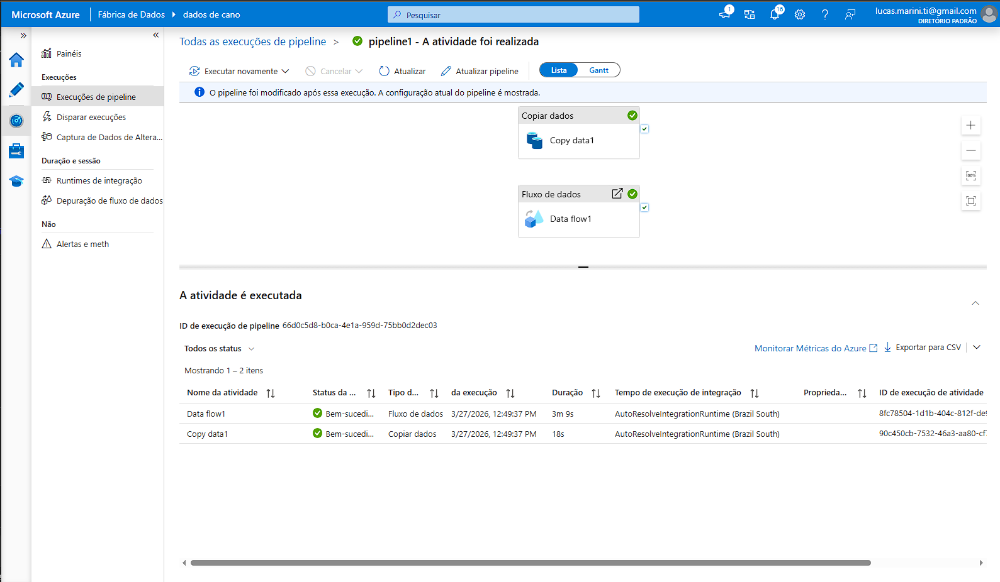
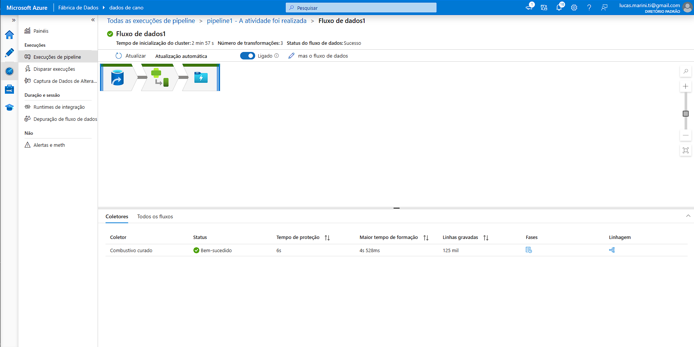
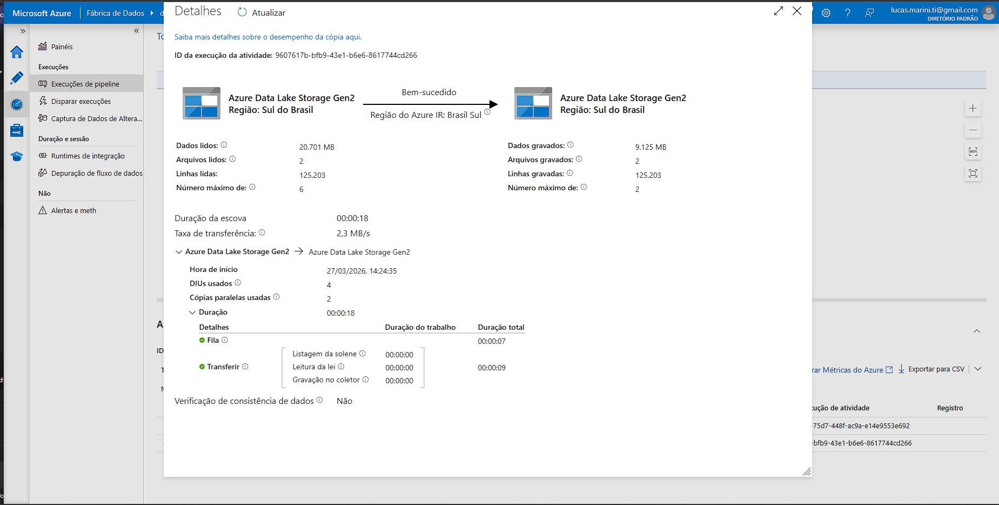
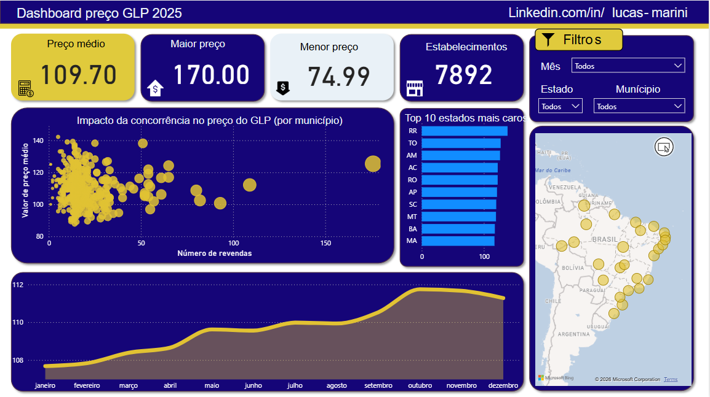

# Projeto de Engenharia de Dados - Análise de Preços de GLP

##  Visão Geral

Este projeto tem como objetivo desenvolver um pipeline completo de engenharia de dados utilizando serviços da Azure, desde a ingestão até a visualização dos dados.

A solução foi construída para analisar a variação de preços do GLP no Brasil, explorando padrões regionais, tendências temporais e possíveis impactos da concorrência.

---

## Tecnologias Utilizadas

* Azure Data Factory (ETL)
* Azure Data Lake Storage Gen2
* Data Flow (transformações)
* Power BI
* CSV (dados públicos)

---

##  Arquitetura do Projeto

Fluxo de dados:

1. Ingestão de arquivos CSV
2. Armazenamento na camada RAW
3. Processamento e limpeza na camada PROCESSED
4. Transformação e padronização na camada CURATED
5. Consumo via Power BI

---

## 🔄 Pipeline de Dados

O pipeline foi desenvolvido no Azure Data Factory com as seguintes etapas:

* Copy Data: ingestão dos arquivos CSV
* Data Flow:

  * Tratamento de dados
  * Conversão de tipos
  * Limpeza de valores nulos
  * Padronização de campos

---

## Transformações de Dados

Principais transformações realizadas:

* Conversão de valores monetários (vírgula → ponto)
* Remoção de espaços e inconsistências
* Conversão de tipos para decimal
* Tratamento de valores nulos

---

## 🗄️ Data Lake (Arquitetura em Camadas)

Estrutura utilizada:

* **RAW** → dados brutos
* **PROCESSED** → dados tratados parcialmente
* **CURATED** → dados prontos para análise

Essa abordagem garante organização, escalabilidade e governança dos dados.

---

## Dashboard

O dashboard foi desenvolvido no Power BI com foco em análise exploratória.

### Principais métricas:

* Preço médio do GLP
* Preço máximo e mínimo
* Quantidade de cidades
* Quantidade de revendas

---

## Análises Realizadas

* Evolução do preço médio ao longo do tempo
* Comparação entre estados (mais caros vs mais baratos)
* Distribuição de preços
* Relação entre número de revendas e preço médio

---

## Insights

* Estados com menor número de revendas tendem a apresentar preços mais elevados
* Existe variação significativa de preços entre regiões
* A concorrência pode impactar diretamente no preço do GLP

---

---

## 📌 Conclusão

Este projeto demonstra a construção de um pipeline completo de dados utilizando Azure, aplicando boas práticas de engenharia de dados e explorando insights relevantes a partir dos dados.

---

## 👨‍💻 Autor

Lucas Marini

---
